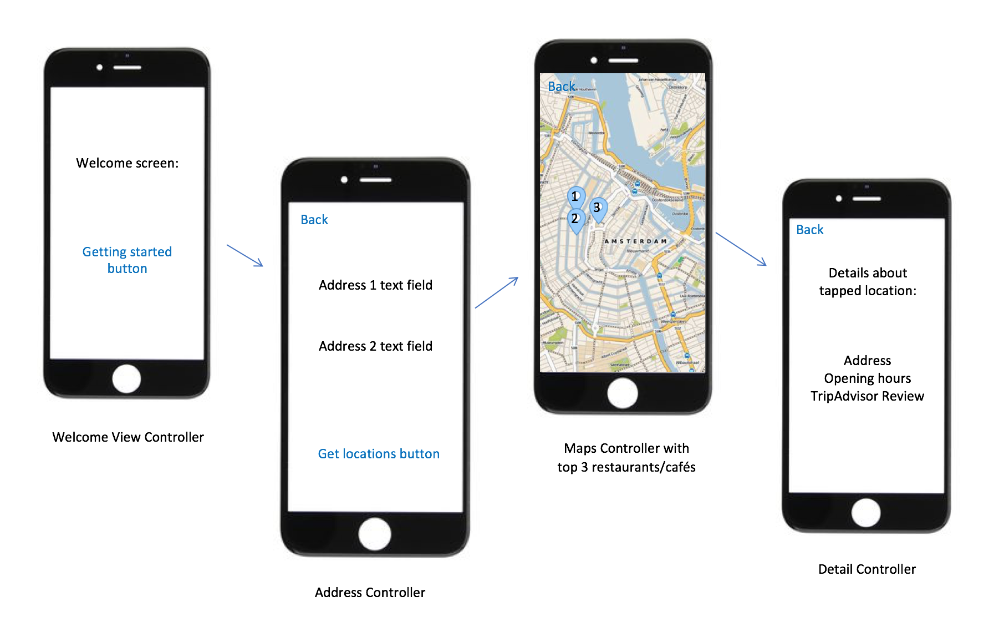

# Project Proposal
Minor Programming, Project Proposal, Eleanoor Polder, 10979301

## Problem Statement
The problem is that you and your friend want to meet, but you don't know where. You want the spot to be in the middle of both addresses so both parties do not have to travel too far. Audience is people who want to meet each other but they don't know where.

## Solution
* Summarize idea: The solution for this problem is an app that takes two addresses and gives a top three restaurants/cafes in the middle of the addresses.
* Visual sketch:

Main features:
* MPV:
  * Welcome View Controller with "getting started" button.
  * Address View Controller with two address textfields and get locations - button.
  * Map View controller with the top three locations in the middle.
  * Detail View Controller with the details about the tapped location: address, opening hours and TripAdvisor Reviews.
  * "Back"-button on the address screen, map screen and detail screen.
* Optional Features:
  * Include more optional addresses to implement, so for example: the middle of three addresses. 
  * Include API from the NS, so the app can give an NS train station in the middle of two addresses. 

## Prerequisites
* Data sources:
  * Google Maps API key with https://developers.google.com/maps/documentation/ios-sdk/get-api-key
  * TripAdvisor API key with https://www.programmableweb.com/api/tripadvisor-content
  * Optional: NS API key to get a train station in the middle of two locations https://www.ns.nl/ews-aanvraagformulier/?0
* Review of similar mobile apps: "Meet me in the middle" is an similar mobile app, but it only gives the location of the spot in the middle, not a restaurant or other place to meet. 
  
  Review: 
  Jul 28, 2015
  AJMcIntyre

  "So simple! So Easy! I have been researching places to meet with friends and family nearby. I have always missed the mark with timing for myself or the other party. This made it very simple to find the middle point and research things to do from there."
 
* Hardest parts: I think the hardest part is to load the data from the API keys. Besides, the top three loacations in the middle have to connect with TripAdvisor's corresponding rating. 
