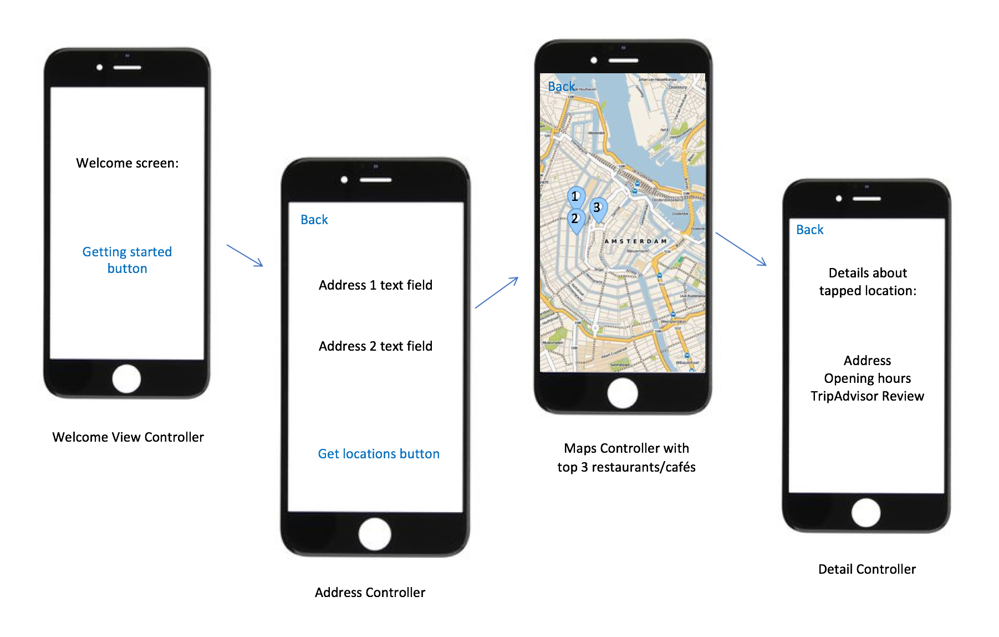

# Project Proposal
Minor Programming, Project Proposal, Eleanoor Polder, 10979301

## Problem Statement
The problem is that you and your friend want to meet, but you don't know where. You want the spot to be in the middle of both addresses so both parties do not have to travel too far. Audience is two people who want to meet each other but they don't know where.

## Solution
* Summarize idea: The solution for this problem is an app that takes two addresses and gives a top three restaurants/cafes in the middle of the addresses.
* Visual sketch:

* Main features:
MPV:
- Welcome screen with getting started button.
- Address controller two address textfields and get locations - button.
- A map with the top three locations in the middle.
- Detail screen with the details about the tapped location: address, opening hours and TripAdvisor Reviews.
- "Back"-button on the address screen, map screen and detail screen.
Optional Features:
- Include more addresses to implement.

## Prerequisites
* Data sources:
* External components:
* Review of similar mobile apps:
* Hardest parts: I think the hardest part is to load the data from the API keys.
