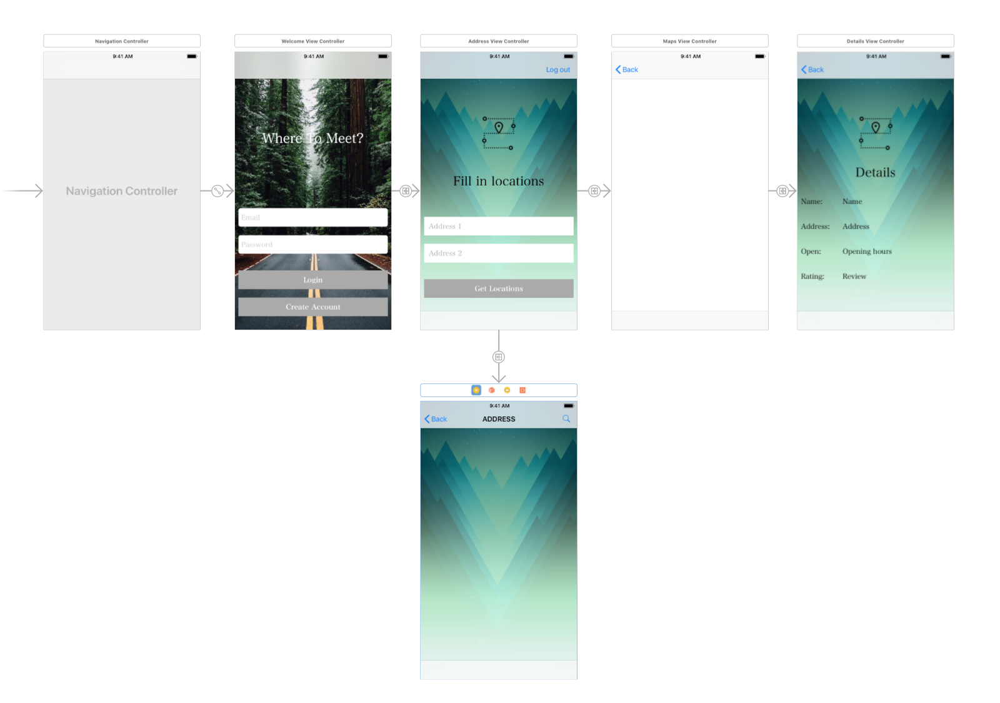

# README
Minor Programming, Final Project  
Elanoor Polder, 10979301

## Visualisation

  
  
  
  
  

## Purpose
This app is made for two friend who want to meet, but they have a problem: where do they want to meet? They both do not want do cycle or drive to far. So here is the solution!! Fill in both addresses and the app will give you the exact middle point in a red marker and the top three restaurants/bars nearby the middlepoint. If tapped on one of the infowindows of the purple marker, details about this location will be showed. So no fighting about where to meet, just meet in the middle!

## Lisence
Copyright (c) 2018 Eleanoor Polder

